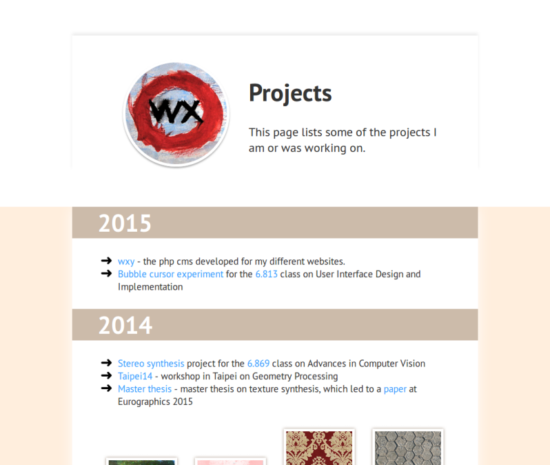

# wxy-light-theme
Light theme for wxy

## Using

* [Colorbox](https://github.com/jackmoore/colorbox) - jquery plugin for simple lightbox effect
* [Respond.js](https://github.com/scottjehl/Respond) - responsive css polyfill
* [Pure css](https://github.com/yahoo/pure/) - set of responsive css modules

## License
MIT
